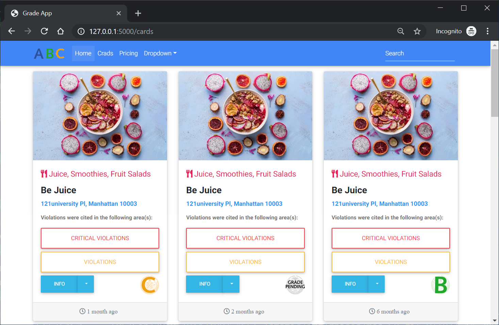

# Grades App
Application that gathers information from New York Department of Health and presents data visually of healthcode violations and inspection grades.

# Mac/Linux setup

    git clone https://github.com/ARBSC/grade.git
    python3 -m venv venv
    source venv/bin/activate
    pip install -r requirements.txt
    python3 app.py

# Windows setup

    git clone https://github.com/ARBSC/grade.git
    python -m venv venv
    venv/Scripts/activate  
    pip install -r requirements.txt
    python app.py

After you run the application is running, visit http://127.0.0.1:5000/

Once you click cards on the navigation you'll see the following page

You'll be able to see the page and grades for each business